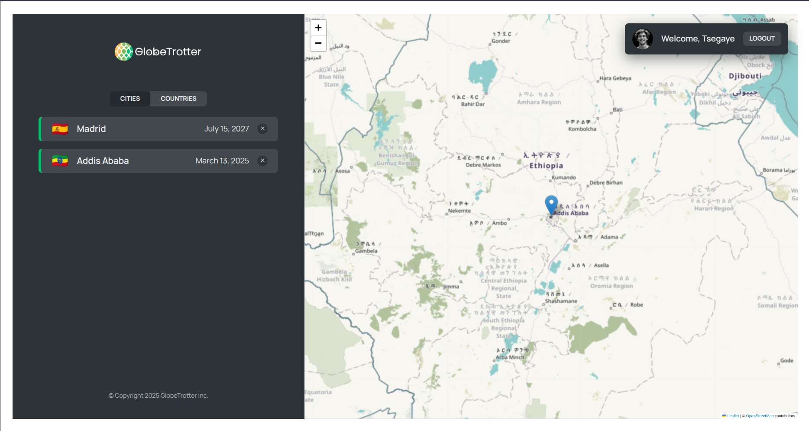

### **GlobeTrotter - Explore the World** 🌍  



**Description**  
GlobeTrotter is an interactive React application where users can explore a dynamic map, mark locations, and leave insights about different places. Perfect for travelers and explorers!  

**Features**  
✅ Interactive world map  
✅ Add and manage location markers  
✅ Leave comments and insights on places  
✅ User-friendly UI for seamless navigation  

**Tech Stack**  
- React.js  
- Leaflet.js for maps  
- Local Storage for state persistence  

**Installation**  
```sh
git clone https://github.com/your-username/globetrotter.git
cd globetrotter
npm install
npm run dev
```

---
